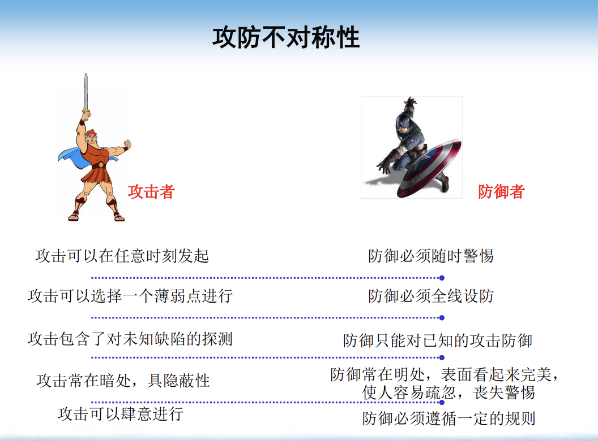
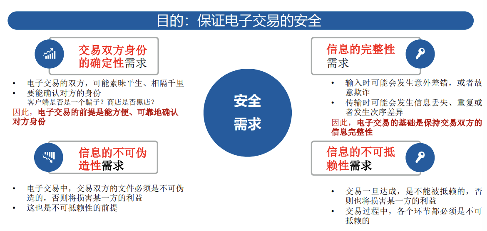
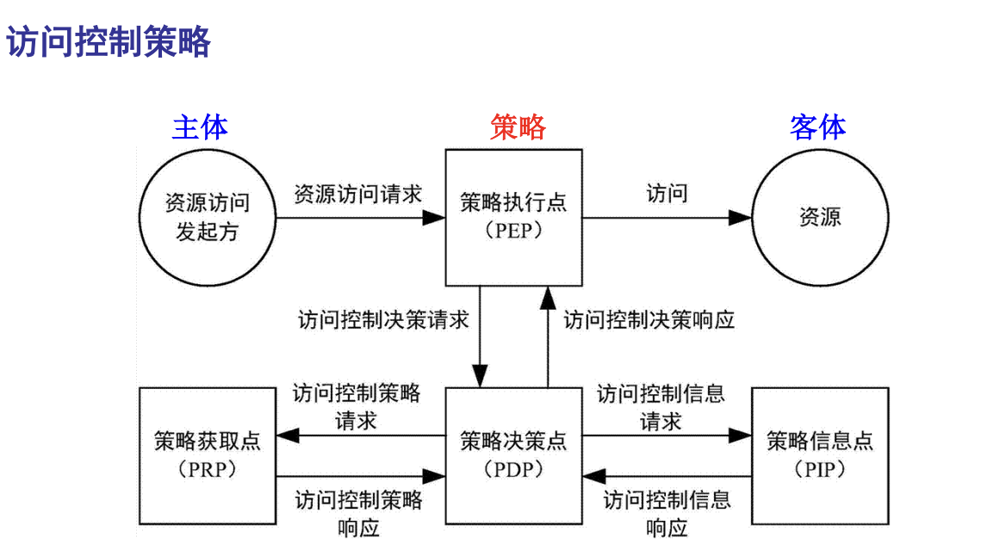
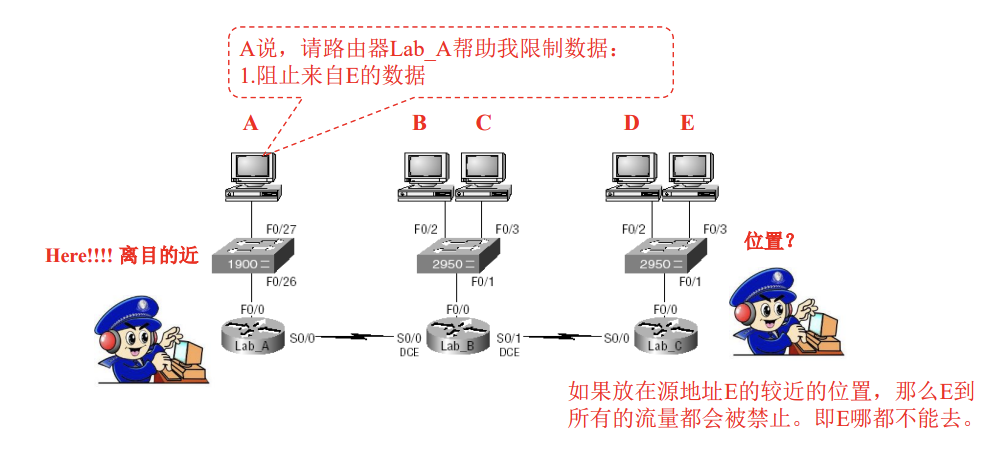
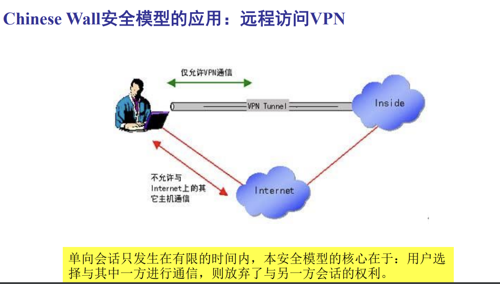

## 1. 信息系统概论
card-last-interval:: -1
card-repeats:: 1
card-ease-factor:: 2.5
card-next-schedule:: 2024-12-11T07:22:27.913Z
card-last-reviewed:: 2024-12-11T07:22:27.914Z
card-last-score:: 1
id:: 6759313a-a42a-4cea-98a6-6c8bf5b80570
collapsed:: true
	- 什么是信息系统
	  logseq.order-list-type:: number
		- 什么是信息系统：
			- 用于**收集、存储和处理数据以及传递信息**、知识和数字产品的一组集成部件。商业公司或其他组织依靠信息系统来开展和管理他们的业务、与客户和供应商互动、并在市场上竞争。
		- 什么是信息系统：
			- ==信息系统是支持数据密集型应用的软硬件系统==。
	- 信息系统的架构
	  logseq.order-list-type:: number
		- 架构的定义
			- background-color:: red
			  
			  架构是针对某种特定目标系统的==普遍性问题==而提供的具有体系性质的、通用的解决方案，是对复杂系统的一种共性的体系抽象，目的是帮助人们能够正确 、合理地理解 、设计和最终构建复杂的系统 。
			- 系统的组成部分、它们相互之间的关系、对环境的关系和指导设计以及演进原则
			  logseq.order-list-type:: number
			- **针对特定系统的普遍性问题  成体系的通用解决方案  复杂系统的抽象体系表达** 目的是帮助人们正确的理解复杂的系统
		- 架构复杂度的定义
			- 动态复杂性：由于**不同节点之间相互关系的多样性和差异性以及动态运行**过程中的不确定性所带来的建设和维护的难度。
			  logseq.order-list-type:: number
			- 结构复杂性：系统中的层次结构给系统建设带来的难度。
			  logseq.order-list-type:: number
			- 动态复杂性：不同节点的动态关系
			- 结构复杂性：系统层次结构
		- ==信息系统复杂性问题是怎么产生的？评价信息系统复杂性的必要性？==
			- **体系结构是信息系统的基本结构**，它的复杂性直接影响着系统的复杂性。（会影响信息系统的安全性，尤其是可靠性）
			  logseq.order-list-type:: number
			- **在体系结构设计阶段有效控制复杂性，不仅可以减小系统实现的难度、降低成本，而且对提高系统可靠性等也有一定的帮助**。因此，对体系结构的复杂性进行度量和评价，对于系统的设计和决策非常重要。通过对体系结构复杂性的研究，对复杂性给出合适的定义和度量方法，就可以采取有效的措施来降低系统复杂性，减小复杂性所带来的不利影响。
			  logseq.order-list-type:: number
			- **等级层次结构是复杂性的主要根源之一**，复杂性与系统的等级层次结构有直接关系，层次越多，越容易产生复杂性。对于系统结构复杂性的度量就可以转换为对体系结构层次结构 复杂性的度量
			  logseq.order-list-type:: number
			- 体系结构是基本结构、体系结构是系统复杂性问题的主要根源之一、有效控制体系结构的复杂性可以很好的减少系统实现的难度降低成本等
	- ==复杂度度量方法==
	  logseq.order-list-type:: number
		- Halstead 复杂性度量
			- 设$n_1$表示程序中不同==运算符==的个数，$n_2$表示程序中**不同==操作数==的个数**，令H表示程序的预测长度
			  $$H=n_1log_2{n_1}+n_2log_2{n_2}$$
			  例子
			  使用五个变量（a、b、c、d和e）进行两两相加的操作。然后我们可以使用Halstead复杂度的概念来分析这段代码。
			  
			  ```java
			  public class Main {
			      public static void main(String[] args) {
			          int a = 1;
			          int b = 2;
			          int c = 3;
			          int d = 4;
			          int e = 5;
			  
			          int result1 = a + b;
			          int result2 = a + c;
			          int result3 = a + d;
			          int result4 = a + e;
			          int result5 = b + c;
			          int result6 = b + d;
			          int result7 = b + e;
			          int result8 = c + d;
			          int result9 = c + e;
			          int result10 = d + e;
			      }
			  }
			  ```
			  在这段代码中：
				- 不同的操作符  $n_1$: `int` `=`, `+` 和 `;`等，因此  $n_1$ = 11。
				  logseq.order-list-type:: number
				- logseq.order-list-type:: number
				  
				  计算Halstead复杂度的时候，我们通常只考虑实际的程序操作符（例如“+”，“=”）和关键字（例如“public”，“class”等）。
				- logseq.order-list-type:: number
				  
				  我们不会将括号、花括号和分号计入操作符，但它们是用来描述程序结构的。根据这样的规则，这里应该有11个不同的操作符。
				- 不同的操作数 n_2:  `a`, `b`, `c`, `d`, `e`, `result1`, `result2`, ..., `result10`, 因此 $n_2$ = 15 。
				  logseq.order-list-type:: number
				- 根据Halstead公式计算预测长度 ( H )：
				  logseq.order-list-type:: number
				  
				  $$
				  \begin{align}
				  H &= n_1 \log_2 n_1 + n_2 \log_2 n_2\\
				  &= 11 \log_2 11 + 15 \log_2 15\\
				  &\approx 97
				  \end{align}
				  $$ 
				  
				  by the way示例代码有64个字符
		- McCabe度量法
			- 算法1
			  
			  $$
			  V(G) = E - N + 2
			  $$
			  
			  其中：
				- V(G)  是循环复杂度
				- E 是控制流图中的**边的数量**
				- N  是控制流图中的**节点数量**
			- 算法2
			  更进一步通过计算程序中的决策点, **if/while/fo**r等循环判断条件语句, 来估算。
			  
			  $$
			  V(G) = P + 1
			  $$
			  
			  其中：
				- V(G) 是循环复杂度
				- P 是程序中的分支数（**if/while/for等循环判断条件语句的数量）
			- {:height 448, :width 687}
			-
	- 能够进行简单的信息系统架构设计：淘宝
	  logseq.order-list-type:: number
	  
		- 数据源
			- 最上层是数据来源
			- RAC（Real Application Clusters）使用Oracle RAC解决方案高可用性数据库配置。
		- 数据传输工具
			- 表示为“传输层”的是负责将数据从数据源传输到Hadoop集群/云存储的工具。
			- 用于实现从源数据库到目标存储系统的数据迁移和同步
		- Hadoop集群/云梯：
			- 这一层显示的是数据存储和计算的主要环境。
		- 数据处理平台：
			- MyFOX和Prom用于数据处理和分析的定制工具或平台。
			- 用于数据清洗、转换和加载（ETL）任务。
		- **数据服务层**：
			- 表示为“数据中间层/glider”的可能是提供数据访问和服务化的中间件层。
			- 这一层处理数据的逻辑处理、服务封装和API暴露，使得上层应用能够访问和使用数据。
		- **上层应用**：
			- 最下方的绿色区域代表上层应用，包括数据可视化、业务逻辑处理和对外暴露的API。
			- 通过报表展示、数据分析或者通过API集成到其他应用。
	- ##  针对”秒杀“百万级并发架构设计，需要采用的关键技术（概率较大）
	  logseq.order-list-type:: number
		- （1）秒杀架构设计思路：
		  
		  ①将请求==拦截在系统上游==，降低下游压力：秒杀系统特点是并发量极大，但实际秒杀成功的请求数量却很少，所以如果不在前端拦截很可能造成数据库读写锁冲突，甚至导致死锁，最终请求超时。
		  ②充分==利用缓存==：利用缓存可极大提高系统读写速度。
		  ③==消息中间件：消息队列可以削峰，将拦截大量并发请求，这是一个异步处理过程==。后台业务根据自己的处理能力，从消息队列中主动地拉取请求消息进行业务处理。
		- （2）百万级并发相关技术：
		  
		  ①**==分布式==**：系统中多个模块在不同服务器上部署，即可成为分布式系统，如Tomcat和数据库分别部署在不同的服务器上。
		  ②**==高可用==**：系统中部分节点失效时，其他节点能够接替它继续提供服务。
		  ③**==集群==**：一个特定领域的软件部署在多台服务器上并作为一个整体提供一类服务，这个整体称为集群。
		  ④**==负载均衡==**：请求发送到系统时，通过某些方式把请求均匀分发到多个节点上。
		  ⑤**==正向代理和反向代理==**：正向代理是代理服务器代替系统内部来访问外部网络的过程，反向代理是外部请求访问系统时通过代理服务器转发到内部服务器的过程。
	-
	-
	-
	-
	-
	-
	-
	-
	-
	-
	-
	-
	-
	-
	-
	-
- ## 2. 信息系统安全概率
  id:: 67593f1a-5939-4102-bc23-11baf5a9e5d5
  collapsed:: true
	- ### 1 信息系统常见的安全威胁
	  collapsed:: true
		- 信息系统安全威胁（threat）是指对于信息系统的组成要素及其功能造成某种损害的潜在可能。
		  collapsed:: true
			- 人为的威胁：
			  logseq.order-list-type:: number
				- 有意：窃听、信息修改、黑客、恶意代码、盗窃
				  logseq.order-list-type:: number
				- 意外：错误和遗漏、文件删除、路由错误、物理事故
				  logseq.order-list-type:: number
			- 自然的威胁：地震、闪电、洪水、火灾
			  logseq.order-list-type:: number
		- #### ==攻击致命度（AL  Attack lethality）==
		  collapsed:: true
			- 
		- ==STIX==
		  collapsed:: true
			- 描述网络威胁信息的结构化语言
			- ==S==tructured ==T==hreat ==I==nformation e==X==pression **结构化威胁信息表达式**
			- 作为一种用于描述网络威胁信息的结构化语言，提供了基于标准 XML 语法描述威胁情报的细节和威胁内容的方法，也描述威胁情报中多方面的特征，包括威胁因素、威胁活动、安全事故等
			- ==五要素==：威胁指标 Indicator 、恶意软件 Malware 、工具 Tool 、 漏洞Vulnerability 、可观测数据 Observed Data 
			  
			  Indicator倾向于恶意行为痕迹
	- ### 2. 信息系统脆弱性
	  collapsed:: true
		- 信息系统的脆弱性：信息资产及其安全措施在安全方面的不足和弱点，脆弱性也常常被成为漏洞。
		- 硬件组件：信息系统硬件组件的安全隐患多来源于设计，主要表现为物理安全方面的问题。
		- 软件组件：软件组件的安全隐患来源于设计和软件工程中的问题。
			- 漏洞
			- 不必要的功能冗余引起安全脆弱性
			- 未按安全等级要求进行模块化设计，安全等级不能达到预期
		- 网络和通信协议：
			- TCP/IP协议族本身的缺陷
			- 基于TCP/IP协议Internet的安全隐患
				- 缺乏对用户身份的鉴别
				- 缺乏对路由协议的鉴别认证
				- CP/UDP的缺陷
	- ### ==3.  信息系统安全概念==
	  collapsed:: true
		- **基于信息保障的信息系统安全概念**如下
		  在信息系统的整个==生命周期==中，通过对信息系统的==风险分析==，制定并执行相应的安全保障策略，从==技术、管理、工程和人员==等方面提出安全保障要求，确保信息系统的==保密性、完整性和可用性== ，降低安全风险到可接受的程度，从而**保障系统实现组织机构的使命 。（目的）**
		  
		  KB：生命周期	风险分析	安全保障策略	人员技术工程管理	CIA
		- ==**信息系统安全保障的目的**==不仅是保护信息和资产的安全，更重要是
		  通过保障信息系统的安全来保障信息系统所支持的业务的安全，从
		  而达到实现企业使命的目的。
			- 进不来 拿不走 看不懂 改不了 跑不了
	- ### ==4. 攻防不对称性==
	  collapsed:: true
		- 
		- **拟态主动防御**:  利用不断变化的运行环境来增加攻击者的不确定性和攻击难度，从而提高系统的安全性。
		- #### 对攻防不对称性的其他解决思路
			- 加强威胁情报共享
			- 强化用户意识
			- 人工智能和机器学习
			- 零信任：企业基于持续验证、动态授权和全局防御三个核心原则构建自己的零信任网络。
			  
			  1） 持续验证，永不信任，构建身份安全基石
			  
			  2） 动态授权，精细访问控制，权限随需而动
			  
			  3） 全局防御，网安协同联动，威胁快速处置
			- SaaS化（软件即服务）、集约化：过去传统安全硬件面临突发威胁根本无法及时更新，但是SaaS化应对新威胁，几个小时之内就能将应对方案全面同步。SaaS化对安全厂商来说，可以更快速地迭代安全产品版本和能力，以应对快速变化的威胁，有效解决‘攻防不对等’的困境。
	- ### ==5. 信息系统安全保障模型CMM==
	  collapsed:: true
		- 框架和维度
		- CMM 框架全称是 "Cybersecurity Maturity Model Certification"（**网络安全成熟度模型认证**）。
		- 
		- 信息系统安全保障体系的保障要素、保障能力级、安全特征、生命周期：
			- 保障要素：人员、技术、工程、管理
			  logseq.order-list-type:: number
			- 保障能力级：0级未实施、1级基本执行、2级计划跟踪、3级充分定义、4级量化控制、5级持续改进
			  logseq.order-list-type:: number
			- 生命周期：规划组织、开发采购、实施交付、运行维护、废弃
			  logseq.order-list-type:: number
			- 安全特征：保密性、完整性、可用性
			  logseq.order-list-type:: number
	- ### ==6. 怎样理解一个信息系统是安全的？== （重点）
	  collapsed:: true
		- （信息保障中，不是技术包揽天下）
		- ==信息网络的硬件、软件及其系统中的数据受到保护，不受偶然的或者恶意的原因而遭到破坏、更改、泄露，系统连续可靠正常地运行，信息服务不中断。==
		- 信息系统安全保障标准（大概率选择题）
			- 《==**GB/T 31495**==.1-2015 信息安全技术 ==信息安全保障指标体系及评价==
			  方法 第1部分：概念和模型》
			- 《GB/T 31495.2-2015 信息安全技术 信息安全保障指标体系及评价
			  方法 第2部分：指标体系》
			- 《GB/T 31495.3-2015 信息安全技术 信息安全保障指标体系及评价
			  方法 第3部分：实施指南》
		- **基于风险控制的理解**：
		  logseq.order-list-type:: number
			- 即把系统的风险控制到一个可以接受的范围之内。
		- **基于状态迁移的理解：**
		  logseq.order-list-type:: number
			- 即系统的状态无论怎么迁移，也不可能进入对应不安全状态的空间。
		- **基于时间的理解：**（24年ppt里只有这个）
		  logseq.order-list-type:: number
		  background-color:: red
			- 信息系统安全是个时间的概念：若发现攻击的时间＋做出响应的时间＜黑客实现攻击的时间，则认为这个信息系统是安全的。
			  background-color:: red
			- 新的安全定义
			  background-color:: red
				- 及时的检测就是安全
				  background-color:: yellow
				- 及时的响应就是安全
				  background-color:: yellow
		- **基于安全体系架构的理解：**
		  logseq.order-list-type:: number
			- 不仅要重视功能上的体系架构，还要重视安全体系架构。以云计算为例，讲稿提供了多种典型安全架构，它们要么提供很好的隔离性，要么以可信、可控的方式，可以保证信息系统的业务连续性。
		- **基于安全策略的理解：**
		  logseq.order-list-type:: number
			- 一个系统是“安全系统”，指的是该系统达到了当初设计时所制定的安全策略的要求。
			- **安全策略**： 针对面临的威胁决定采用何种对策的方法
			  **安全策略意义上的信息系统安全**： 该系统达到了当初设计时所制定的安全策略的要求。
	- ==云计算安全架构的最新发展：了解==
	  collapsed:: true
		- （1） 基于可信根的安全架构
		- （2） 基于隔离的安全架构
		- （3） 安全即服务的安全架构
		- （4） 可管、可控、可度量的云计算安全架构：
	-
	-
- ## 3. 安全需求以及安全策略
  id:: 67594ae6-58ab-439f-9ad3-41132937d1ac
  collapsed:: true
	- ### 1. 安全需求
	  collapsed:: true
		- 就是在设计一个安全系统时==期望得到的安全保障==
		- 启动阶段的目标
			- 根据业务流程、系统功能、目标用户、工作环境等，定义系统的需求
			  logseq.order-list-type:: number
			- 明确约束条件，包括场地、设备、经费、人员等
			  logseq.order-list-type:: number
			- **==起草一份针对系统的安全策略==**
			  logseq.order-list-type:: number
				- 这是这一阶段必不可少的部分，是构建一个可信系统的**基础**
			- 
		- 一般性需求
			- **机密性需求** ，防止信息被泄漏给未授权的用户
			- **完整性需求**， 防止未授权用户对信息的==修改==
			- **可用性需求**， 保证授权用户对系统信息的==可访问性==
			- **可记账性需求**， 防止用户对访问过某信息或执行过某一操作以否认，可对发生的事件、操作等进行回溯
			- 举例
			  
	- ### 2.  安全策略
	  collapsed:: true
		- ==针对面临的威胁决定采用何种对策的方法==
		  信息系统安全策略提供：信息系统保护的内容和目标，信息保护的职责落实，实施信息保护的方法，事故的处理等。
		  （要保护什么 ，谁来负责、怎么做、出事了怎么办）
		- 一个信息系统是“安全系统”，指的是该系统达到当初设计时所制定的安全策略的要求
		- 实例：secpol.msc、windows 2008 server r2
		- 
	- ### 3. 最常用的安全策略
	  collapsed:: true
		- 
	- ### ==4. 自主访问控制策略（DAC）ACL必考==
	  collapsed:: true
		- #### DAC相关信息
			- 主要就在==**自主**==两个字上
			- DAC概念：允许系统中信息的拥有者按照自己的意愿去指定对象以何种访问模式去访问该客体。
			- **Windows中的访问控制模型是Windows安全性的基础构件**
				- 访问控制模型有两个主要的组成部分：访问令牌（Access Token）和安全描述符（Security Descriptor）。它们分别是访问者和被访问者拥有的东西。
				- 通过访问令牌和安全描述符的内容，Windows可以确定持有令牌的访问者能否访问持有安全描述符的对象。
				- 有令牌且符合安全描述符要求的windows才会放行
			- 自主访问控制的优点：
			  background-color:: red
				- 访问模式设定灵活。
				  background-color:: red
				- 具有较好的适应性，常用于商用OS和应用中。
				  background-color:: red
			- 自主访问控制的缺点
			  background-color:: green
				- 不能防范木马和某些形式的恶意代码
				  background-color:: green
		- ####  访问控制列表（ACL）
			- background-color:: yellow
			  
			  定义：访问控制列表是一系列允许或拒绝数据的指令的集合。具有灵活的数据过滤盒控制能力。
			- 原则：最小特权原则、最靠近受控对象原则、默认丢弃原则
				- 编号：1） 1-99或1300-1999是标准ACL使用的，100-199或2000-2699是拓展ACL使用的。
		- #### 标准ACL
			- 源ip过滤，设置在目的路由器
			- 
			- 访问列表号==1～99==
				- 传统范围：1-99和1300-1999
		- #### 扩展ACL
			- **源IP地址、目的IP地址、协议字段（如，TCP、UDP、ICMP等）以及端口号**。
			- 
			- **靠近源地址路由器**
				- 使用访问列表号**100～199**创建扩展的访问列表
					- 传统范围：100-199和2000-2699
		- #### 命名ACL
			- 命名ACL以列表名代替列表编号来定义IP访问控制列表，同样包括标准和扩展两种列表，定义过滤的语句与编号方式中相似。
	- ### ==5. 语法 （必考，而且要会写）==
	  collapsed:: true
		- #### 创建标准ACL
			- ```apl
			  Router(config)# access-list access-list-number { permit | deny } source [source-wildcard]
			  //例子
			  //这条命令将允许源地址为192.168.1.0到192.168.1.255的所有数据包通过。
			  Router(config)# access-list 10 permit 192.168.1.0 0.0.0.255
			  //注意取掩码的反码
			  ```
			- #### 字段解释
				- `Router(config)#`：这是Cisco IOS的命令提示符，表示您目前处于全局配置模式。
				- **`access-list`**: 命令关键字，用于定义访问控制列表。
				- **`access-list-number`**: 指定访问列表的编号。对于标准ACL，通常是1-99的范围。
				- **`{ permit | deny }`**: 指定动作，可以是以下两种：
					- **`permit`**: 允许数据包通过。
					- **`deny`**: 拒绝数据包通过。
				- **`source`**: 指定源IP地址。
				- **`[source-wildcard]`**: 可选的通配符掩码，用于指定源IP地址的范围。
				  注意取掩码的反码
		- #### 删除标准ACL
			- #### 命令格式
			  
			  ```apl
			  Router(config)# no access-list access-list-number
			  //例子
			  //这条命令将删除编号为10的访问控制列表。
			  Router(config)# no access-list 10
			  ```
			- #### 字段解释
				- **`Router(config)#`**: 这是Cisco IOS的命令提示符，表示您目前处于全局配置模式。
				- **`no`**: 命令前缀，用于撤消先前的命令或设置。
				- **`access-list`**: 命令关键字，用于定义访问控制列表。
				- **`access-list-number`**: 指定要删除的访问列表的编号。
		- #### 扩展ALC创建指令
			- 创建扩展访问控制列表（ACL）通常涉及到在网络设备（如路由器或交换机）上执行特定的命令。扩展ACL比标准ACL提供更详细的控制，允许基于源地址、目的地址、协议类型、端口号等过滤流量。以下是一个通用的命令格式用于创建和配置扩展ACL，以及各参数的含义：
			- ##### 基本命令格式
			  
			  ```apl
			  access-list [ID] [permint/deny] [协议] [源IP地] [源通配符掩码] [目的IP] [目的通配符掩码] [操作符] [端口/服务类型]
			  ```
			- **操作符**：通常用于定义端口号。常见的操作符包括：
				- ==eq（等于）：指定目标端口必须等于某个特定值==
				- `gt`（大于）：指定目标端口必须大于某个特定值。
				- `lt`（小于）：指定目标端口必须小于某个特定值。
			- **端口**：端口号是用来标识主机上的特定网络服务。在ACL中，端口号用来定义特定类型的网络流量，如HTTP流量通常使用端口80。
			- **服务类型**：这是指网络上的特定服务或协议。例如，HTTP、FTP、SSH等都是不同的服务类型，它们分别在网络层使用特定的协议和端口号。在ACL中，可以指定这些服务类型来控制特定协议的流量。
		- #### 通配符
			- ==host==
				- host关键字用于指明这条规则仅适用于这一个特定的IP地址，而非一个地址范围。
				- 如果没有使用`host`关键字，需要提供一个IP地址和一个通配符掩码来定义一个IP地址范围。
				- ```apl
				  Lab_A(config)#access list 110 deny tcp any **host 172.16.30.2** eq www
				  ```
				  含义：拒绝任何IP 地址通过 TCP 协议访问主机172.16.30.2的www服务。
			- ==any==
				- 如果 `any` 用在规则中指定源IP地址或目的IP地址，它意味着规则适用于所有可能的IP地址。例如，如果在源地址位置使用 `any`，则该规则适用于来自任何IP地址的流量。
		- #### 题目：
			- ```apl
			  要禁止内网中 IP 地址为 192.168.46.8 的 PC 机访问外网, 正确的 ACL 规则是
			  A. access-list 1 permit ip 192.168.46.0 0.0.0.255 any
			  access-list 1 deny ip host 192.168.46.8 any
			  B. access-list I permit ip host 192.168.46.0 0.0.0.255 any 
			  access-list 1 deny ip 192.168 .46 .0 0.0.0.255 any
			  C. access-list 1 deny ip 192.168.46.0 0.0.0.255 any 
			  access-list 1 permit ip host 192.168.46.8 any
			  D. access-list 1 deny ip host 192.168.46.8 any 
			  access-list 1 permit ip 192.168 .46 .0 0.0.0.255 any
			  ```
			  
			  这题选D，先定义的先执行，因此要先ban掉，再允许这个网段的其他ip访问。
	- ###  通配编码
	  collapsed:: true
		- 路由器使用IP地址和通配掩码（wildcard-mask）一起来分辨匹配的地址范围，它跟子网掩码刚好相反。
		  
		  它不像子网掩码告诉路由器IP地址的哪一位属于网络号一样，通配符掩码告诉路由器为了判断出匹配，它需要检查IP地址中的多少位。
		  有了通配掩码，可以只使用两个32位的号码来确定IP地址的范围，这是十分方便的！
		  
		  如果没有掩码的话，不得不对每个匹配的IP地址加入一个单独的ACL语句。这将造成很多额外的输入和路由器大量额外的处理过程。所以地址掩码相当有用。
		- 通配掩码原理是分成4字节的32bit数
		  logseq.order-list-type:: number
		- 通配掩码与IP地址位位配对，相应位为0/1，用于表示如何对待IP地址中的相应位。
		  logseq.order-list-type:: number
		  
		  ①通配掩码某位是0表示检查相应bit位的值
		  
		  ②通配掩码某位是1表示不检查（忽略）相应位的值
		- 通配源码举例：
		  logseq.order-list-type:: number
		   
		  因此本例中通配掩码为0.0.15.1
		- any——通配符特殊应用：
		  logseq.order-list-type:: number
			- 
		- host——通配符特殊应用：
		  logseq.order-list-type:: number
			- 
	- ###  ==强制访问控制策略（MAC）==
		- ####  定义
			- 在强制访问控制系统中，所有主体（用户，进程）和客体（文件，数据）都被分配了安全标签，安全标签标识一个安全等级。
			- 主体（用户，进程）被分配一个安全等级
			- 客体（文件，数据）也被分配一个安全等级
			- 访问控制执行时对主体和客体的安全级别进行比较
		- 经典场景：军事机密及其管理
		- ➢ 无密级；保密；机密；绝密。
		  ❖ 强制访问控制，基于上述原型而来
		  ➢ 主体/客体：贴上标签
		  ➢ 引用监视器：比较标签，决定是否许可
		  ❖ 效果：保证完整性或机密性
		- 最显著的特征：全局性和永久性
		  background-color:: red
			- 无论何时何地，主体和客体的标签是不会改变的。
			- ==全局性==：对特定的信息，从任何地方访问，它的敏感级别相同
			- ==永久性==：对特定的信息，在任何时间访问，它的敏感级别相同
			- 上述特征在多级安全体系中称为“==宁静性原则==”（tranquility）
		- 一旦不满足该原则，无法从根本上防备木马和恶意代码
		- #### 附加：
			- MAC存在的问题：
				- 隐通道问题：仍然无法检测到高安全级主体和低安全级客体在不违反安全策略的情况下通过合谋传输秘密信息。
		- #### BLP保密模型
			- 概念：
				- Bell-LaPadula保密性模型是第一个能够提供分级别数据==机密性==保障的安全策略模型（多级安全）。
			- BLP模型允许用户读取安全级别比他低的资源；相反地，写入对象的安全级别只能高于用户级别。
			- BLP 保密模型基于两种规则来保障数据的机密度与敏感度：
				- 不上读（NRU）⎯⎯主体不可读安全级别高于它的数据
				  background-color:: red
				- 不下写（NWD）⎯⎯主体不可写安全级别低于它的数据
				  background-color:: red
			- BLP模型的应用——防火墙所实现的单向访问机制：
				- 防火墙所实现的单向访问机制不允许敏感数据从内部网络（所有内部数据被标志为“机密”或“高密”）流向Internet（安全级别为“公开”）。
				- 防火墙提供“不上读”功能来阻止Internet对内部网络的访问；
				- 提供“不下写”功能来限制进入内部的数据流只能经由由内向外发起的连接流入。（例如，允许HTTP的“GET”操作而拒绝“POST”操作，或阻止任何外发的邮件）。
			- 不上读和不下写
				- 不上读 NRU（No Read Up）：主体不可读安全级别高于它的数据
				- 不下写 NWD（No Write Down）：主体不可写安全级别低于它的数据
			- **优点**：
				- **适用性广**：由于其简单的原则，BLP模型适用于需要严格保密性的环境.
				  **缺点**：
				- **不考虑数据完整性**：BLP模型专注于保密性而不是数据完整性，因此不能防止数据被授权用户篡改。
				- **动态性不足**：在需要频繁数据交换的环境中，BLP模型的固定规则可能会阻碍数据共享和协作。
					- BLP模型允许用户读取安全级别比他低的资源；相反地，写入对象的安全级别只能高于用户级别。
		- ####  BIBA完整性模型
			- 强调==完整性==
				- 不下读（ NRU ）属性主体不能读取安全级别低于它的数据
				  不上写（ NWD ）属性主体不能写入安全级别高于它的数据
			- **优点**：
				- **避免数据污染**：通过限制低完整性级别的用户访问更高完整性级别的数据，防止了数据被污染。
			- **缺点**：
				- **灵活性有限**：BIBA模型较为严格，可能会限制某些合法的数据访问和操作，影响业务流程的灵活性。
				- **复杂的实施**：在实际环境中实施BIBA模型可能会相对复杂，需要精确地定义完整性级别和相应的控制策略。
			- ##### 防火墙
				- Internet上用户的安全级别为“公开”，依照 BIBA 模型， Web 服务器上数据的完整性将得到保障.
				- Internet 上的用户只能读取服务器上的数据而不能更改它。因此，任何 POST 操作将被拒绝。
		- #### Chinese Wall模型
			- Chinese Wall模型应用在多边安全系统中（也就是多个组织间的访问控制系统），
			  目标主要就是==防止利益冲突的发生==
				- Chinese Wall模型最初是为投资银行设计的，主要关注商业利益问题，使用范围有限，但也可应用在其它相似的场合。在投资银行中，一个银行会同时拥有多个互为竞争者的客户，一个银行家可能为一个客户工作，但他可以访问所有客户的信息。因此，应当制止该银行家访问其它客户的数据
			- Chinese Wall模型的主要功能是==防止用户访问被认为是存在利益冲突的数据。==、
			- 
		- ####  SSR
			- （是否可以设计一种基于BLP模型和BIBA模型的混合模型，从而技能保护数据的==机密性==，又能保证其==完整性==）
			- SSR的访问控制为
				- 允许同级别的主体对客体享有所有权限；
				- 高级别主体对低级别客体享有只读权限；
				- 低级别主体对高于自己级别的客体没有任何权限
			- SSR的主要特点
				- 信息流只能从低级别流向高级，确保信息的保密性
				- 高级别主题队低级别客体的访问只能进行读取，确保了低级别资源的完整性
		- ###  安全策略如何应用到防火墙等安全设备中？
			- BLP模型的应用——防火墙所实现的单向访问机制：防火墙所实现的单向访问机制不允许敏感数据从内部网络（所有内部数据被标志为“机密”或“高密”）流向Internet（安全级别为“公开”）。
			- 防火墙提供“不上读”功能来阻止Internet对内部网络的访问；
			- 提供“不下写”功能来限制进入内部的数据流只能经由由内向外发起的连接流入。（例如，允许HTTP的“GET”操作而拒绝“POST”操作，或阻止任何外发的邮件）。
		-
- ## 4.安全风险评估
  collapsed:: true
	- ### 4.1 风险的概念
		- 风险： 风险指在某一特定环境下，在某一特定时间段内，特定的威胁利用资产的一种或一组薄弱点，导致资产的丢失或损害的潜在可能性，==即特定威胁事件发生的可能性与后果的结合。==
			- 风险越大则安全性越低，反之风险越小则安全性越高。
		- 残余风险：采取了一系列安全措施后，仍然存在的风险
	- ### 4.3 安全风险度量/评估
		- 安全风险概念模型
			- 安全风险四要素：==信息系统资产（Asset）==、==信息系统脆弱性（Vulnerability）==、==信息安全威胁（Threat）==、==信息系统安全保护措施（Safeguard）==。、
			- 跟上面的四个是对应的
		- 概念定义
			- 对信息系统整体安全态势的感知和对重大安全事件的预警，实现“==事前能预防，事中能控制，事后能处理”==。
			- 风险评估是参照国家有关标准对信息系统及由其处理、传输和存储信息的保密性、完整性和可用性等安全属性进行分析和评价的过程。它要分析：
			  collapsed:: true
				- 资产面临的威胁及威胁利用脆弱性导致安全事件的**可能性**；
				- 根据资产价值来判断安全事件一旦发生对组织**造成的影响**。
		- **风险评估围绕着==资产、威胁 、脆弱性和安全措施==这些基本要素展开 。**
		- 风险评估实质上就是要度量风险各要素之间的**相互作用关系**
		- 脆弱性越多，”威胁“（实际上就是黑客）利用脆弱性导致安全事件的可能性就越大
		- **残余风险应受到密切监视，它可能会在将来诱发新的安全事件**
	- ### 4.4 信息系统安全风险计算模型（基本原理） #card
	  card-last-interval:: 4
	  card-repeats:: 1
	  card-ease-factor:: 2.36
	  card-next-schedule:: 2024-12-15T12:55:20.531Z
	  card-last-reviewed:: 2024-12-11T12:55:20.532Z
	  card-last-score:: 3
	  collapsed:: true
		- 法律：==**GB/T20984-2007**==
		- 风险计算模型是对通过风险分析计算风险值过程的抽象，它主要包括**资产评估、威胁评估、脆弱性评估**。
		  collapsed:: true
			- 
			- 风险分析涉及资产、威胁、脆弱性等基本要素，每个要素有各自的属性：
			  （1） 资产的属性是资产价值，
			  （2） 威胁的属性是威胁出现的频率，
			  （3） 脆弱性的属性是资产弱点的严重程度。
	- ### 4.5 风险处置策略（基本原理）
		- **降低风险（Reduce Risk）**
			- 采取适当的控制措施来降低风险，包括技术手段和管理手段，如安装防火墙，杀毒软件，或是改善不规范的工作流程、制定业务连续性计划，等等。
		- **避免风险（Avoid Risk)**
			- 通过消除可能导致风险发生的条件来避免风险的发生，如将公司内外网隔离以避免来自互联网的攻击，或是将机房安置在不可能造成水患的位置等等。
		- **转移风险（Transfer Risk)**
			- 将风险全部或者部分地转移到其他责任方，例如购买商业保险。
		- **接受风险（Accept Risk)**
			- 在实施了其他风险应对措施之后，对于残留的风险，可以有意识地选择接受。
	- ### 4.6基本操作.
		- **1 风险评估（这一套必须掌握！）**
			- 必须把这一套流程都掌握下来，对攻击性，对资产进行评分…不会纠结为什么那么评分，而是一套流程对不对。评分，设计公式计算出一个值，最后得出一个归一化的风险值是0-5。
		- #### 4.3.1 AV资产评估
			- 针对==**资产保密性、完整性、可用性**==1~5分重要性赋值
			- 然后计算资产登记，也是赋值1~5，
			- AV=F(AC, AI, AA)
			  Asset Value 资产价值
			  Asset Confidentiality 资产保密性赋值
			  Asset Integrity 资产完整性赋值
			  Asset Availability 资产可用性赋值
			- 注意如果采用
			  AV=AC+AI+AA
			  AV=AC × AI × AA
			  那么最后也是根据比例进行赋值1~5
		- #### 4.3.2 T威胁评估
		  
		  针对威胁出现频率进行1~5分赋值
		- #### 4.3.3 V脆弱性评估
		  
		  针对系统脆弱性进行1~5分赋值
		- #### 4.3.4 风险计算
			- 
			- 风险=资产价值×威胁评估×脆弱性评估
			  总分125，也是1~5风险大小赋分
			- 
		- #### 5. 残余风险评价
			- 绝对安全（即零风险）是不可能的。
			- 实施安全控制后会有残留风险或残存风险。
			- 为确保信息安全，应该确保残留风险在可接受的范围内：
			  1） 残留风险Rr＝原有风险R0-控制ΔR
			  2） 残留风险Rr≤可接受的风险Rt
			  3） 对残留风险进行确认和评价的过程其实就是风险接受的过程。决策者可以根据风险评估的结果来确定一个阈值，以该阈值作为是否接受残留风险的标准。
	-
-
-